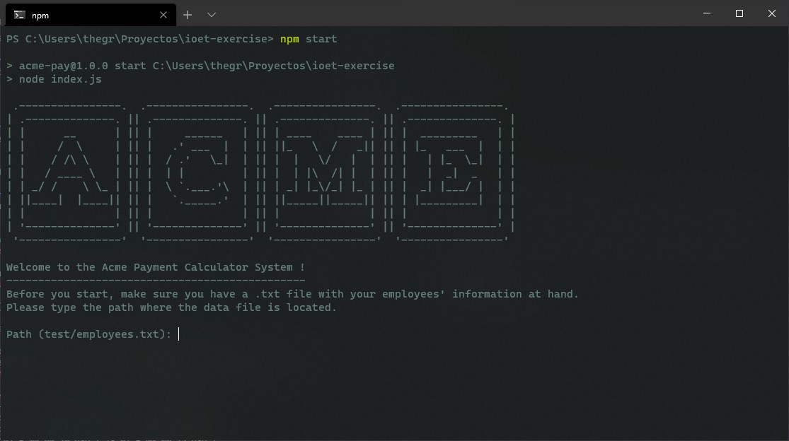
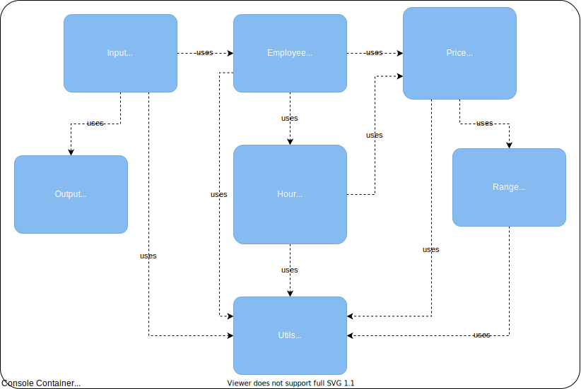

```
.----------------.  .----------------.  .----------------.  .----------------. 
| .--------------. || .--------------. || .--------------. || .--------------. |
| |      __      | || |     ______   | || | ____    ____ | || |  _________   | |
| |     /  \     | || |   .' ___  |  | || ||_   \  /   _|| || | |_   ___  |  | |
| |    / /\ \    | || |  / .'   \_|  | || |  |   \/   |  | || |   | |_  \_|  | |
| |   / ____ \   | || |  | |         | || |  | |\  /| |  | || |   |  _|  _   | |
| | _/ /    \ \_ | || |  \ `.___.'\  | || | _| |_\/_| |_ | || |  _| |___/ |  | |
| ||____|  |____|| || |   `._____.'  | || ||_____||_____|| || | |_________|  | |
| |              | || |              | || |              | || |              | |
| '--------------' || '--------------' || '--------------' || '--------------' |
 '----------------'  '----------------'  '----------------'  '----------------' 
```


[](https://code.visualstudio.com/)

Hello !

In this space I provide everything needed to run the console program and an overview of how I did it.

## Quickstart install

```js
{
 npm: 6.14.4 or higher ✅
 node: v12.18.0 or higher ✅
}
```

Clone the project:

```cmd
git clone https://github.com/thegreatyamori/acme-exercise
```

Go to the app directory:

```cmd
cd acme-exercise
```

Install dev dependencies:

```cmd
npm install
```

Run:

```cmd
npm start
```

Run tests:

```cmd
npm run test
```

## Usage

After running the program, simply enter the `txt` path or leave blank to run test data.

> You can use absolute or relative path.



## Problem Description

Exercise

The company ACME offers their employees the flexibility to work the hours they want. They will pay for the hours worked based on the day of the week and time of day, according to the following table:

#### Monday - Friday

---

| Start Hour | Finish Hour | Price/h |
| ---------- | ----------- | ------- |
| 00:01      | 09:00       | 25 USD  |
| 09:01      | 18:00       | 15 USD  |
| 18:01      | 00:00       | 20 USD  |

#### Saturday and Sunday

---

| Start Hour | Finish Hour | Price/h |
| ---------- | ----------- | ------- |
| 00:01      | 09:00       | 30 USD  |
| 09:01      | 18:00       | 20 USD  |
| 18:01      | 00:00       | 25 USD  |

The goal of this exercise is to calculate the total that the company has to pay an employee, based on the hours they worked and the times during which they worked. The following abbreviations will be used for entering data:

| Monday | Tuesday | Wednesday | Thursday | Friday | Saturday | Sunday |
| ------ | ------- | --------- | -------- | ------ | -------- | ------ |
| MO     | TU      | WE        | TH       | FR     | SA       | SU     |

Input: the name of an employee and the schedule they worked, indicating the time and hours. This should be a .txt file with at least five sets of data. You can include the data from our two examples below.

Output: indicate how much the employee has to be paid

| Input                                                                      | Output                              |
| -------------------------------------------------------------------------- | ----------------------------------- |
| RENE=MO10:00-12:00,TU10:00-12:00,TH01:00-03:00,SA14:00-18:00,SU20:00-21:00 | The amount to pay RENE is: 215 USD  |
| ASTRID=MO10:00-12:00,TH12:00-14:00,SU20:00-21:00                           | The amount to pay ASTRID is: 85 USD |

## Architecture

I used a small component diagram based on the C4 architecture. This diagram allows me to see in a general way how the different components communicate in the resolution of the exercise.



I performed a preliminary analysis of the exercise to understand what the problem to be solved was.

## Approach & Methodology

After performing the analysis I created this table to get an overview of how to manipulate the data.

|Start Hours|Finish Hours|MO|TU|WE|TH|FR|SA|SU|
|---|---|---|---|---|---|---|---|---|
|00:01|09:00|25|25|25|25|25|30|30|
|09:01|18:00|15|15|15|15|15|20|20|
|18:01|00:00|20|20|20|20|20|25|25|

- I wrote the actions that the program had to accomplish in order to solve the problem.
- I designed the component diagram.
- I distributed the program design into easy to do tasks.
- I created and configured nodeJS + Jest + Git environment tox the project.
- I designed and develop the tests needed to test the solution to the problem.
- Using a simple files structure, I wrote the code needed to validate and process the input, calculate the working hours for each day, calculate the hourly price for each day and finally the total price.
- I performed the tests and refactored the code in some parts.
- I uploaded the project to GitHub and configured the GitHub Actions to automate the tests.

To develop the solution I took a TDD (Test Driven Development) approach, trying to write as less code as possible. This allowed me to improve the communication flow between components and refactor the code for maintainability reasons.

For task management I used [Notion](https://www.notion.so/ ) using a Kanban board.


And for time management [Wakatime](https://wakatime.com/).

